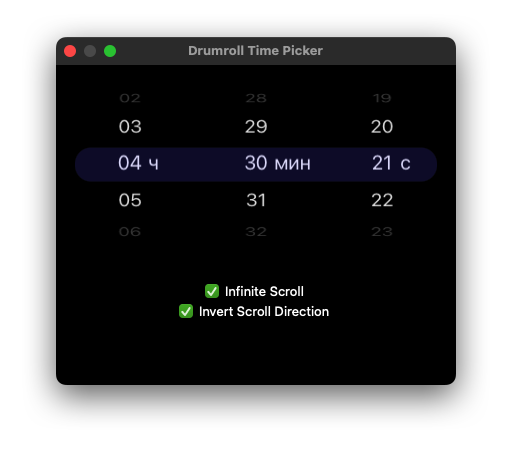

# DrumrollTimePicker

A macOS drum-roll style time picker, recreating the iOS `UIDatePicker` look in AppKit — entirely programmatic, no Storyboard.



## Features

- Hours, minutes, and seconds (24‑hour format)
- Drag, scroll‑wheel, and momentum scrolling
- Infinite or bounded scroll mode
- Invert scroll direction
- Cylindrical 3D drum effect with perspective transform
- Dark iOS‑style appearance
- Per‑item CATextLayers (no flicker)
- Unified selection highlight bar

## Requirements

- macOS 14.0+
- Swift 5.9+

## Installation

### Swift Package Manager

Add to your `Package.swift`:

```swift
dependencies: [
    .package(url: "https://github.com/your-username/DrumrollTimePicker.git", from: "1.0.0")
]
```

Or add it via Xcode: **File → Add Package Dependencies…** and enter the repository URL.

## Usage

```swift
import DrumrollTimePicker

let picker = DrumrollTimePicker(frame: NSRect(x: 0, y: 0, width: 370, height: 220))
picker.showsSeconds = true
picker.isInfiniteScrollEnabled = true
picker.isScrollDirectionInverted = true

// Read the selected time
if let time = picker.selectedTime {
    print("\(time.hour):\(time.minute):\(time.second)")
}
```

## License

MIT
